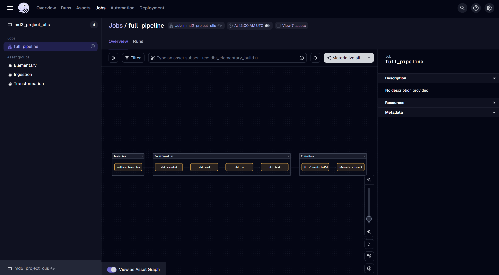
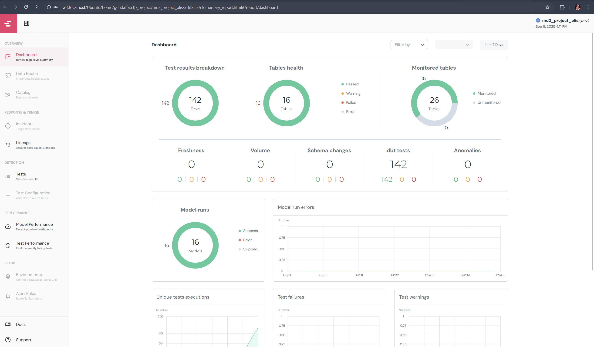
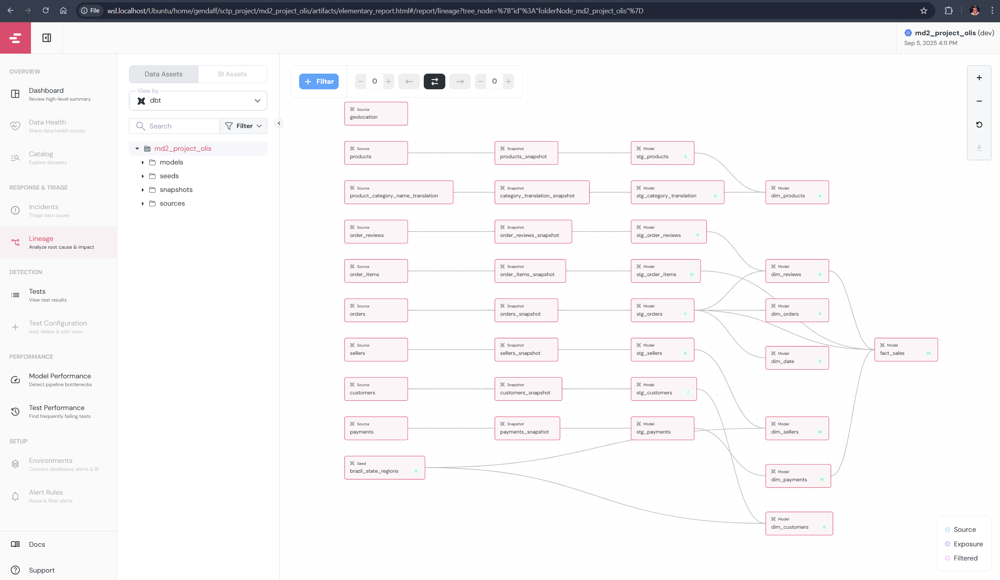

# Meltano + Dagster + dbt + BigQuery Pipeline

## Quickstart
1) Copy env_sample -> .env
2) change to your "PROJECT_ID" and "CREDENTIALS_PATH"
3) `conda deactivate`
4) `conda env remove --name olisenv`
5) `conda env create -f environment.yml`
4) `conda activate olisenv`
7) `cd meltano_project`
8) `meltano lock --update --all`
9) `cd ../dbt_project`
10) `dbt clean`
11) `dbt deps`
12) Go to project root `cd ..`
13) Start Dagster UI: `dagster dev`
14) Click `full_pipeline` -> `Materialize All`
15) To view elementary dashboard, find the file "elementary_report.html" in the "artifacts" directory, open it with your browser, (below illustration)
16) You can also open with your chrome, with your project path, `file://wsl.localhost/Ubuntu/home/gendaff/sctp_project/md2_project_olis/artifacts/elementary_report.html`  
15) To run streamlit, open a new terminal and change into streamlit directory, `cd streamlit_dashboard`
16) `conda activate olisenv`
17) `streamlit run streamlit_app.py`

## Extra installation, if you want the elementary report to auto popup browser after job run
1) Install chromium on WSL `sudo apt install chromium-browser`
2) To browse from terminal, open the filepath `xdg-open /home/gendaff/test_project/md2_project_olis/artifacts/elementary_report.html`

## Successful Dagster UI
Below is an example screenshot of a healthy `full_pipeline` job graph after `dagster dev` starts successfully:



## Elementary Dashboard


## Elementary Lineage


## Structure
- `dagster_project/` Dagster assets/resources/jobs/schedules
- `streamlit_directory` Streamlit Dashboard
- `dbt_project/` dbt models and profiles
- `meltano_prject/` 
- `docs/` diagram + report
- `notebooks/` EDA


## Troubleshooting
If `conda install` fails due to missing packages, run the following commands to add the conda-forge channel and set strict channel priority:

```bash
conda config --add channels conda-forge
conda config --set channel_priority strict
```
