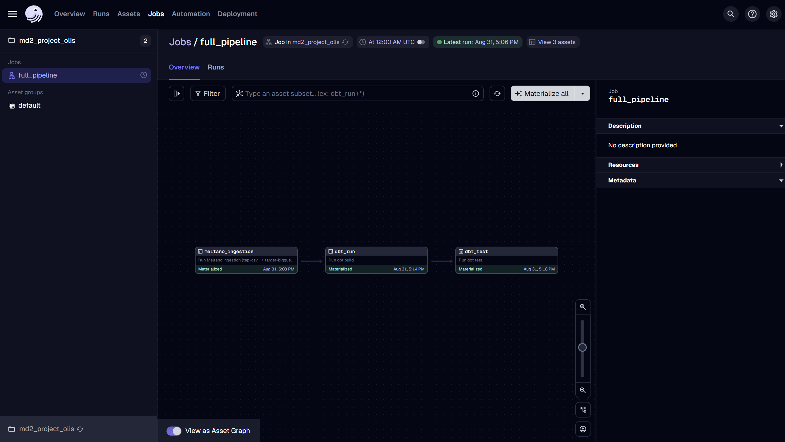

# Meltano + Dagster + dbt + BigQuery Pipeline

## Quickstart
1) Copy env_sample -> .env
2) change to your "PROJECT_ID" and "CREDENTIALS_PATH"
3) `conda deactivate`
4) `conda env remove --name olisenv`
5) `conda env create -f environment.yml`
4) `conda activate olisenv`
7) `cd meltano_project`
8) `meltano lock --update --all`
9) Go to project root `cd ..`
10) Start Dagster UI: `dagster dev`
11) Click full_pipeline -> Materialize All
12) To run streamlit, open a new terminal and change into streamlit directory, `cd streamlit_dashboard`
13) `conda activate olisenv`
14) `streamlit run streamlit_app.py`

### Successful Dagster UI
Below is an example screenshot of a healthy `full_pipeline` job graph after `dagster dev` starts successfully:




## Structure
- `dagster_project/` Dagster assets/resources/jobs/schedules
- `streamlit_directory` Streamlit Dashboard
- `dbt_project/` dbt models and profiles
- `meltano_prject/` 
- `docs/` diagram + report
- `notebooks/` EDA


## Troubleshooting
If `conda install` fails due to missing packages, run the following commands to add the conda-forge channel and set strict channel priority:

```bash
conda config --add channels conda-forge
conda config --set channel_priority strict
```

If you see `the dagster-webserver python package must be installed`:
1. Make sure the correct env is active: `conda activate olisenv` (or your env name).
2. Verify install: `pip show dagster-webserver` (should list a version like 1.8.12).
3. If missing, install (matching dagster version): `pip install "dagster-webserver==$(python -c 'import dagster;print(dagster.__version__)')"`.
4. Launch UI: `dagster dev` (or `python -m dagster dev`).
5. Still failing? Check that `which dagster` points inside your env (e.g. `.../envs/olisenv/bin/dagster`). If not, reactivate the env or open a new shell.

