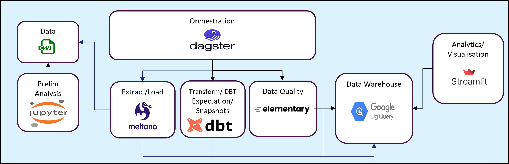
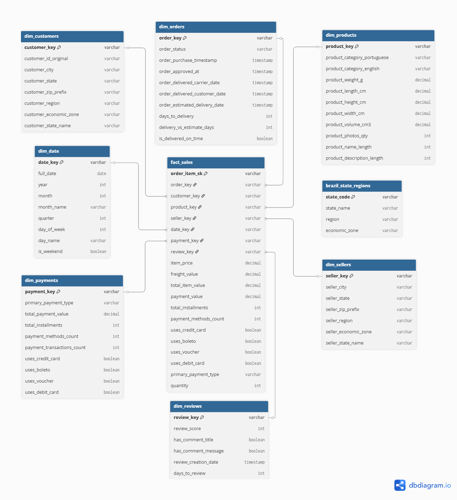
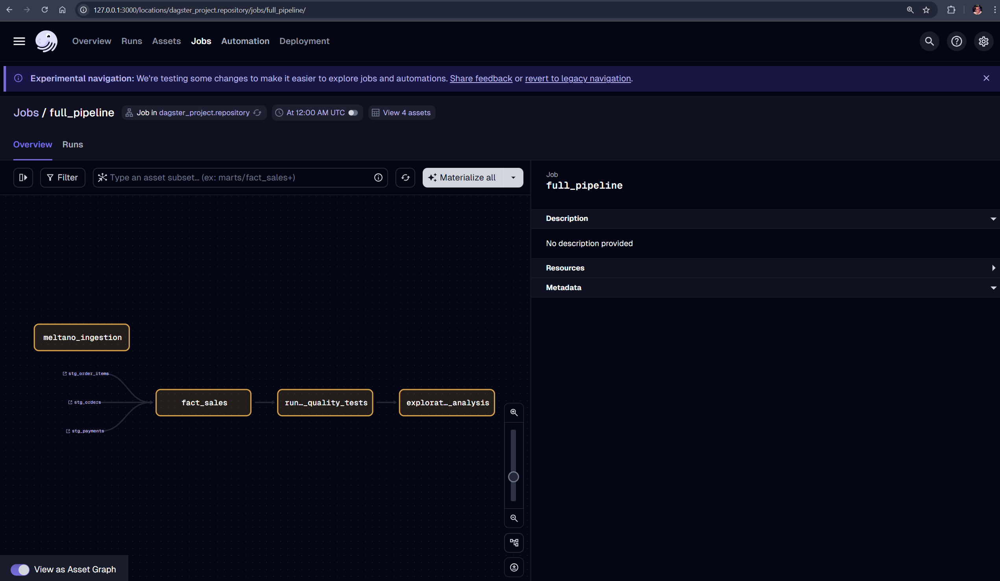

# Olist E-commerce Data Pipeline

A comprehensive end-to-end data pipeline and analytics platform for Brazilian e-commerce data from Olist, built with modern data engineering tools including Dagster, dbt, Meltano, BigQuery, and Streamlit.



## 🎯 Project Overview

This project demonstrates a production-grade data pipeline that extracts raw CSV data, loads it into BigQuery, transforms it into a star schema optimized for analytics, implements data quality validation, orchestrates all processes with Dagster, and provides interactive dashboards for business insights.

### Key Features
- **Modern ELT Architecture**: Meltano → BigQuery → dbt → Streamlit
- **Orchestration**: Dagster for workflow management and monitoring
- **Data Quality**: Elementary for automated testing and lineage tracking
- **Analytics Ready**: Star schema optimized for business intelligence
- **Interactive Dashboards**: Streamlit for real-time data exploration

## 🏗️ Architecture

### Data Flow Overview
```
CSV Files → Meltano (Extract & Load) → BigQuery Raw → dbt (Transform) → BigQuery Marts → Streamlit Dashboard
                                           ↓
                                    Elementary (Quality & Lineage)
                                           ↓
                                    Dagster (Orchestration)
```

### Technology Stack
- **Orchestration**: [Dagster](https://dagster.io/) - Asset-based data orchestration
- **Ingestion**: [Meltano](https://meltano.com/) - ELT platform for CSV → BigQuery
- **Transformation**: [dbt](https://www.getdbt.com/) - SQL-based data transformations
- **Data Warehouse**: [Google BigQuery](https://cloud.google.com/bigquery) - Cloud data warehouse
- **Quality Monitoring**: [Elementary](https://www.elementary-data.com/) - Data observability
- **Visualization**: [Streamlit](https://streamlit.io/) - Interactive web applications
- **Environment**: Conda for dependency management

## 📊 Business Intelligence Focus

This pipeline is designed to answer 8 critical business questions through a carefully designed star schema:

### Key Business Questions
1. **Monthly Sales Trends** - Revenue, volume, and order value trends over time
2. **Top Products & Categories** - Highest performing products and categories
3. **Geographic Sales Distribution** - Regional performance across Brazil
4. **Customer Purchase Behavior** - Purchase patterns, frequency, and lifetime value
5. **Payment Method Impact** - Payment preferences and installment patterns
6. **Seller Performance Analysis** - Top sellers and regional performance
7. **Product Reviews & Sales Correlation** - Review impact on sales
8. **Delivery Time Patterns** - Delivery performance and regional efficiency

### Star Schema Design



The schema implements a **single fact table** (`fact_sales`) at the **order item grain** connected to 7 dimension tables:

#### Fact Table: `fact_sales`
- **Grain**: One record per order item
- **Key Measures**: `item_price`, `freight_value`, `total_item_value`, `payment_value`
- **Foreign Keys**: Links to all dimension tables

#### Dimension Tables:
- **`dim_customers`** - Customer details with regional classifications
- **`dim_products`** - Product catalog with categories and specifications
- **`dim_sellers`** - Seller information with geographic data
- **`dim_orders`** - Order status and delivery metrics
- **`dim_payments`** - Payment methods and transaction details
- **`dim_reviews`** - Customer reviews and ratings
- **`dim_date`** - Time dimension for trend analysis

#### Enhanced Features:
- **Economic Zones** - Brazilian economic region classifications
- **Regional Analysis** - State-to-region mapping via seed data
- **Delivery Metrics** - Performance calculations and on-time delivery flags
- **Payment Aggregation** - Multi-payment method support per order

## 🚀 Quick Start

### Prerequisites
1. **Google Cloud Project** with BigQuery API enabled
2. **Service Account** with BigQuery permissions
3. **Conda** for environment management

### Setup Instructions

#### 1. Environment Configuration
```bash
# Clone repository and navigate to project
cd md2_project_olis

# Copy environment template and configure
cp env_sample .env
# Edit .env with your PROJECT_ID and CREDENTIALS_PATH
```

#### 2. Conda Environment Setup
```bash
# Create and activate new environment
conda env create -f environment.yml
conda activate olisenv
```

#### 3. Tool Initialization
```bash
# Initialize Meltano
cd meltano_project
meltano lock --update --all

# Initialize dbt
cd ../dbt_project
dbt clean
dbt deps

# Return to project root
cd ..
```

#### 4. Pipeline Execution
```bash
# Start Dagster UI
dagster dev

# Navigate to localhost:3000 in browser
# Click 'full_pipeline' → 'Materialize All'
```

#### 5. Dashboard Access
```bash
# In a new terminal, start Streamlit dashboard
cd streamlit_dashboard
conda activate olisenv
streamlit run streamlit_app.py

# Access dashboard at localhost:8501
```

## 📈 Successful Pipeline Execution

### Dagster Pipeline View
After successful execution, your Dagster UI should show all assets materialized:



### Elementary Data Quality Dashboard
Monitor data quality and lineage through Elementary:


Access the Elementary report at: `file://[your-path]/artifacts/elementary_report.html`

### Data Lineage Visualization
Track data flow and dependencies:


## 🗂️ Project Structure

```
md2_project_olis/
├── 📁 dagster_project/          # Orchestration layer
│   ├── assets/                  # Dagster asset definitions
│   ├── jobs/                    # Pipeline job definitions
│   ├── resources/               # External system connections
│   └── repository.py            # Main Dagster configuration
├── 📁 dbt_project/              # Transformation layer
│   ├── models/
│   │   ├── staging/            # Cleaned raw data (views)
│   │   └── marts/              # Analytics-ready data (tables)
│   ├── seeds/                  # Reference data
│   └── dbt_project.yml         # dbt configuration
├── 📁 meltano_project/         # Ingestion layer
│   └── meltano.yml             # Extraction configuration
├── 📁 streamlit_dashboard/     # Presentation layer
│   ├── utils/                  # Query and visualization helpers
│   └── streamlit_app.py        # Main dashboard application
├── 📁 data/                    # Source CSV files
├── 📁 artifacts/               # Elementary reports
├── 📁 docs/                    # Documentation and diagrams
└── 📁 notebooks/               # Exploratory data analysis
```

## 🔄 Development Workflow

### Daily Operations
```bash
# Start the pipeline
dagster dev                     # Terminal 1: Orchestration
streamlit run streamlit_app.py  # Terminal 2: Dashboard
```

### Development Commands

#### Dagster
```bash
dagster dev                     # Start UI and daemon
# Navigate to localhost:3000 for pipeline monitoring
```

#### dbt (from dbt_project/)
```bash
dbt run                         # Execute transformations
dbt test                        # Run data quality tests
dbt docs generate && dbt docs serve  # Generate documentation
```

#### Meltano (from meltano_project/)
```bash
meltano run tap-csv target-bigquery  # Manual data extraction
meltano lock --update --all     # Update extractor dependencies
```

### Data Pipeline Layers

#### 1. Raw Layer (`olist_raw`)
- **Purpose**: Exact copy of CSV source data
- **Characteristics**: All STRING data types, Meltano metadata included
- **Tables**: `raw_customers`, `raw_orders`, `raw_order_items`, etc.

#### 2. Staging Layer (`olist_staging`)
- **Purpose**: Cleaned and typed data preparation
- **Transformations**: Data type conversion, standardization, basic validation
- **Models**: `stg_customers`, `stg_orders`, `stg_order_items`, etc.

#### 3. Marts Layer (`olist_marts`)
- **Purpose**: Analytics-ready star schema
- **Models**: `fact_sales`, `dim_customers`, `dim_products`, etc.
- **Features**: Business calculations, derived metrics, optimized for queries

## 📊 Analytics Capabilities

### Regional Analysis
- **Geographic Coverage**: All 27 Brazilian states + Federal District
- **Economic Zones**: Amazon, Northeast, Southeast, South, Central regions
- **Cross-Regional**: Customer vs seller location analysis

### Customer Intelligence
- **Segmentation**: By region, economic zone, purchase behavior
- **Lifecycle**: First purchase to repeat customer analysis
- **Value Analysis**: Customer lifetime value calculations

### Product Performance
- **Category Analysis**: 71+ product categories with English translations
- **Inventory Metrics**: Dimensions, weight, photo count analysis
- **Review Correlation**: Rating impact on sales performance

### Operational Insights
- **Delivery Performance**: On-time delivery rates, regional variations
- **Payment Patterns**: Method preferences, installment analysis
- **Seller Efficiency**: Performance by region and economic zone

## 🔧 Configuration

### Environment Variables (.env)
```bash
PROJECT_ID=your-gcp-project-id
CREDENTIALS_PATH=path/to/service-account.json
RAW_DATASET_NAME=olist_raw
STAGING_DATASET_NAME=olist_staging
MARTS_DATASET_NAME=olist_marts
SNAPSHOTS_DATASET_NAME=olist_snapshots
```

### BigQuery Dataset Structure
```
your-gcp-project-id/
├── olist_raw/          # Raw CSV data
├── olist_staging/      # Cleaned staging data
├── olist_marts/        # Analytics star schema
└── olist_snapshots/    # Historical data snapshots
```

## 🔍 Data Quality & Monitoring

### Elementary Integration
- **Automated Testing**: Data quality checks at each pipeline stage
- **Lineage Tracking**: Complete data flow visualization
- **Anomaly Detection**: Statistical analysis and alerting
- **Report Generation**: HTML dashboards for quality monitoring

### dbt Testing
- **Schema Tests**: Column constraints and referential integrity
- **Custom Tests**: Business logic validation
- **Data Freshness**: Monitoring for stale data

### Great Expectations (Future Enhancement)
- **Raw Data Validation**: Post-ingestion quality checks
- **Business Logic Validation**: Marts layer verification
- **Automated Reporting**: Quality scorecards and alerts

## 🚨 Troubleshooting

### Common Issues

#### Environment Setup
```bash
# If conda install fails
conda config --add channels conda-forge
conda config --set channel_priority strict
```

#### Permission Errors
- Verify GCP service account has BigQuery Data Editor permissions
- Check CREDENTIALS_PATH points to valid service account JSON
- Ensure PROJECT_ID matches your GCP project

#### dbt Issues
```bash
cd dbt_project
dbt debug                       # Test connections
dbt clean && dbt deps          # Reset dependencies
```

#### Dagster UI Access
- Default port: `localhost:3000`
- If port conflicts, check terminal output for alternate port
- Ensure conda environment is activated

### Pipeline Debugging
1. **Check Dagster Asset Status** - View materialization logs in UI
2. **Review BigQuery Tables** - Verify data quality in warehouse
3. **Elementary Reports** - Check for data anomalies
4. **dbt Logs** - Review transformation execution details

## 📚 Additional Resources

### Documentation
- [Dagster Documentation](https://docs.dagster.io/)
- [dbt Documentation](https://docs.getdbt.com/)
- [Meltano Documentation](https://docs.meltano.com/)
- [Elementary Documentation](https://docs.elementary-data.com/)

### Project Files
- `notebooks/` - Exploratory data analysis notebooks and kaggle dataset download script
- `docs/` - Project presentation slides and project related diagrams and screenshots

## 🤝 Contributing

This project demonstrates modern data engineering best practices and can serve as a template for similar e-commerce analytics pipelines. Key learnings include:

- **Asset-based orchestration** with Dagster for better dependency management
- **ELT pattern** leveraging cloud data warehouse transformation capabilities
- **Dimensional modeling** optimized for analytical workloads
- **Data quality integration** throughout the pipeline lifecycle
- **Self-service analytics** through intuitive dashboard interfaces

---

**Built with ❤️ using modern data engineering tools and best practices**
